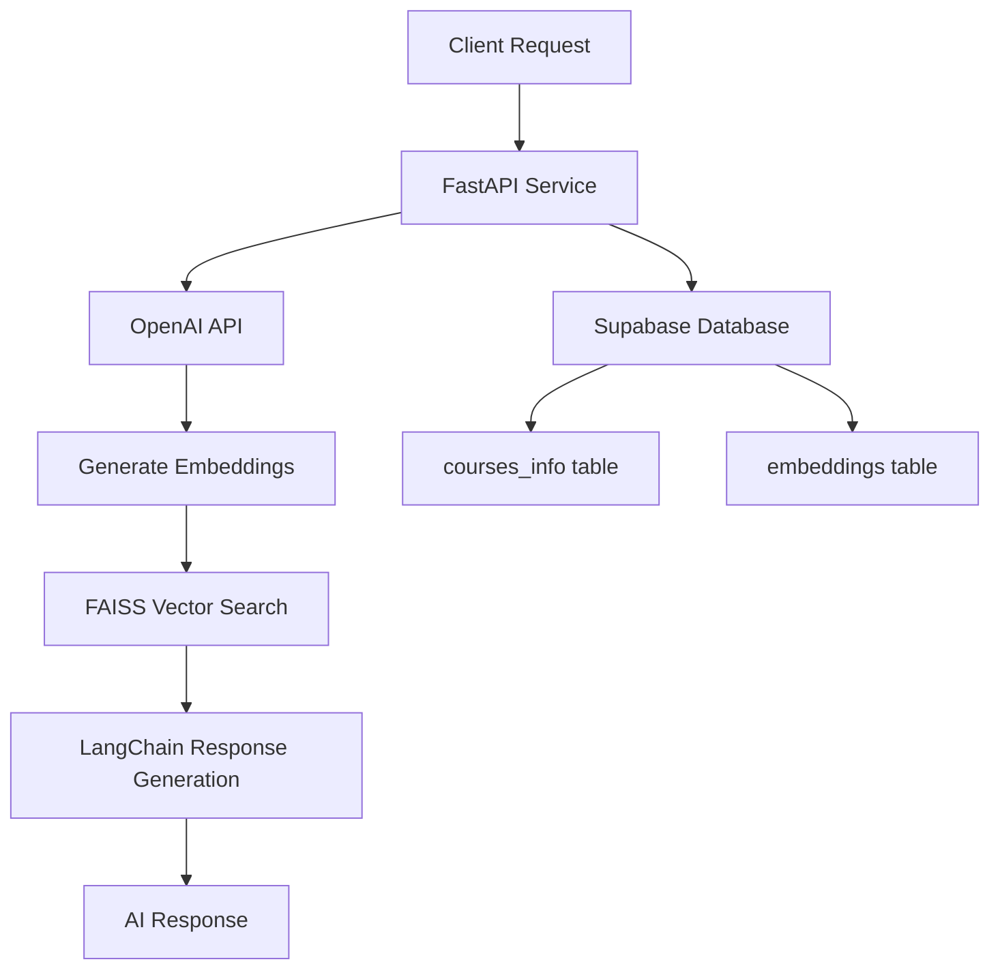

# Course Information Management System with Vector Embeddings

A FastAPI-based microservices system for managing course content with AI-powered semantic search capabilities using OpenAI embeddings and Supabase as the backend database.

## 🚀 Features

- **CRUD Operations**: Create, read, update, and delete course information
- **Vector Embeddings**: Automatic generation of embeddings using OpenAI's `text-embedding-3-small` model
- **Semantic Search**: AI-powered query responses using FAISS vector similarity search
- **LangChain Integration**: Advanced response generation with context-aware AI
- **Supabase Backend**: Scalable database with real-time capabilities
- **RESTful APIs**: Clean and well-documented FastAPI endpoints

## 📁 Project Structure

```
supabase/
├── create_data_embeddings.py    # Service for ingesting course content
├── update_data_embeddings.py    # Service for updating existing content
├── delete_data_embeddings.py    # Service for deleting course records
├── query_response.py           # AI-powered query and response service
├── requirements.txt            # Python dependencies
├── .env                       # Environment variables (not in repo)
└── README.md                  # This file
```

## 🛠 Services Overview

### 1. **Create Data Embeddings Service** (`create_data_embeddings.py`)
- **Port**: 8000
- **Endpoint**: `POST /ingest`
- **Purpose**: Ingests course content and generates embeddings
- **Features**:
  - Accepts single or batch course data
  - Stores content in `courses_info` table
  - Generates and stores embeddings in `embeddings` table
  - Combines course title, lesson title, and content for embedding generation

### 2. **Update Data Embeddings Service** (`update_data_embeddings.py`)
- **Port**: 8001
- **Endpoint**: `PUT /update`
- **Purpose**: Updates existing course content and regenerates embeddings
- **Features**:
  - Partial updates (content, course title, or lesson title)
  - Automatic embedding regeneration
  - Maintains data consistency across tables

### 3. **Delete Data Embeddings Service** (`delete_data_embeddings.py`)
- **Port**: 8000
- **Endpoint**: `DELETE /delete`
- **Purpose**: Removes course records and associated embeddings
- **Features**:
  - Delete by course title, lesson title, or both
  - Cascading deletion across both tables
  - Detailed deletion reports

### 4. **Query Response Service** (`query_response.py`)
- **Port**: 8000
- **Endpoint**: `POST /query`
- **Purpose**: AI-powered semantic search and response generation
- **Features**:
  - FAISS vector similarity search
  - LangChain-powered response generation
  - Context-aware answers with source attribution
  - Configurable top-k results

## 🔧 Setup Instructions

### Prerequisites
- Python 3.8+
- Supabase account and project
- OpenAI API key

### 1. Clone and Setup Environment
```bash
# Navigate to project directory
cd supabase

# Create virtual environment
python -m venv venv

# Activate virtual environment
# Windows:
venv\Scripts\activate
# macOS/Linux:
source venv/bin/activate

# Install dependencies
pip install -r requirements.txt
```

### 2. Environment Configuration
Create a `.env` file in the project root:
```env
SUPABASE_URL=your_supabase_project_url
SUPABASE_KEY=your_supabase_anon_key
OPENAI_API_KEY=your_openai_api_key
```

### 3. Database Setup
Create the following tables in your Supabase project:

#### `courses_info` table:
```sql
CREATE TABLE courses_info (
    id UUID PRIMARY KEY DEFAULT gen_random_uuid(),
    content TEXT NOT NULL,
    course_title TEXT NOT NULL,
    lesson_title TEXT NOT NULL,
    created_at TIMESTAMP WITH TIME ZONE DEFAULT NOW(),
    updated_at TIMESTAMP WITH TIME ZONE DEFAULT NOW()
);
```

#### `embeddings` table:
```sql
CREATE TABLE embeddings (
    id UUID PRIMARY KEY,
    content TEXT NOT NULL,
    course_title TEXT NOT NULL,
    lesson_title TEXT NOT NULL,
    embedding VECTOR(1536), -- OpenAI text-embedding-3-small dimension
    FOREIGN KEY (id) REFERENCES courses_info(id) ON DELETE CASCADE
);
```

## 🚀 Running the Services

Each service can be run independently:

### Create/Ingest Service
```bash
python create_data_embeddings.py
# Runs on http://localhost:8000
```

### Update Service
```bash
python update_data_embeddings.py
# Runs on http://localhost:8001
```

### Delete Service
```bash
python delete_data_embeddings.py
# Runs on http://localhost:8000
```

### Query/Response Service
```bash
python query_response.py
# Runs on http://localhost:8000
```

## 📚 API Usage Examples

### 1. Ingest Course Content
```bash
curl -X POST "http://localhost:8000/ingest" \
  -H "Content-Type: application/json" \
  -d '{
    "data": {
      "content": "Machine learning is a subset of artificial intelligence...",
      "course_title": "AI Fundamentals",
      "lesson_title": "Introduction to ML"
    }
  }'
```

### 2. Update Course Content
```bash
curl -X PUT "http://localhost:8001/update" \
  -H "Content-Type: application/json" \
  -d '{
    "course_title": "AI Fundamentals",
    "lesson_title": "Introduction to ML",
    "new_content": "Updated content about machine learning..."
  }'
```

### 3. Query for Information
```bash
curl -X POST "http://localhost:8000/query" \
  -H "Content-Type: application/json" \
  -d '{
    "query": "What is machine learning?",
    "top_k": 3
  }'
```

### 4. Delete Course Records
```bash
curl -X DELETE "http://localhost:8000/delete" \
  -H "Content-Type: application/json" \
  -d '{
    "course_title": "AI Fundamentals",
    "lesson_title": "Introduction to ML"
  }'
```

## 🔍 Key Technologies

- **FastAPI**: Modern, fast web framework for building APIs
- **Supabase**: Open-source Firebase alternative with PostgreSQL
- **OpenAI Embeddings**: State-of-the-art text embeddings for semantic search
- **FAISS**: Efficient similarity search and clustering of dense vectors
- **LangChain**: Framework for developing applications with language models
- **Pydantic**: Data validation using Python type annotations

## 🏗 Architecture



## 🔒 Security Notes

- Store API keys securely in `.env` file
- Never commit `.env` file to version control
- Use Supabase Row Level Security (RLS) for production
- Implement rate limiting for production deployments
- Validate and sanitize all input data

## 🤝 Contributing

1. Fork the repository
2. Create a feature branch
3. Make your changes
4. Add tests if applicable
5. Submit a pull request

## 📄 License

This project is licensed under the MIT License.

## 🆘 Troubleshooting

### Common Issues:

1. **Environment Variables**: Ensure all required environment variables are set in `.env`
2. **Database Connection**: Verify Supabase URL and key are correct
3. **OpenAI API**: Check API key validity and rate limits
4. **Dependencies**: Ensure all packages in `requirements.txt` are installed
5. **Port Conflicts**: Make sure ports 8000/8001 are available

### Support
For issues and questions, please check the documentation or create an issue in the repository.
